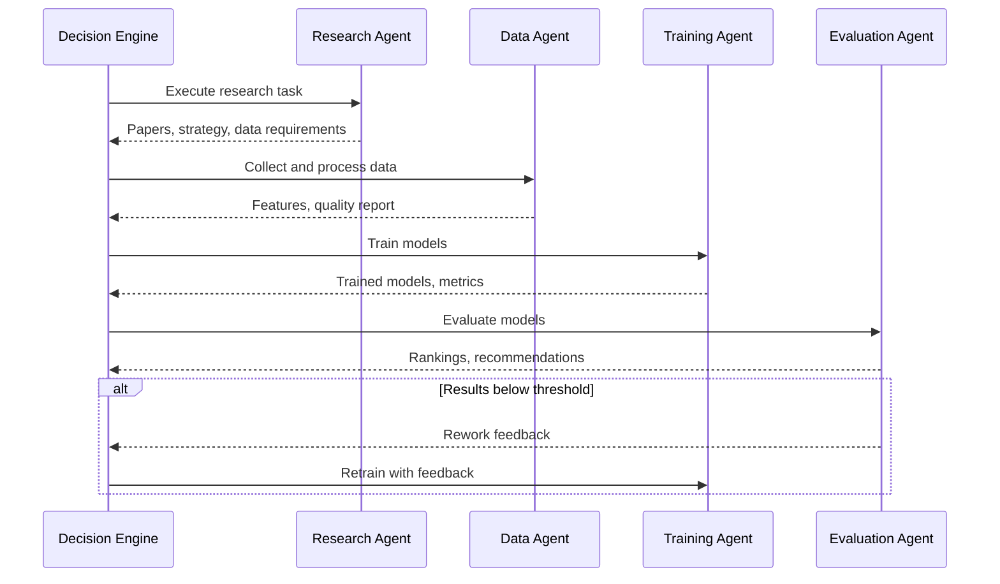

# System Architecture

## Overview

The Multi-Agent AI Research Assistant is a distributed system with four specialized agents orchestrated by a Decision Engine. Communication occurs via a message bus with feedback loops for iteration.

## System Diagram

```
┌─────────────────────────────────────────────────────────────────┐
│                      Decision Engine                            │
│  ┌─────────────┐  ┌─────────────┐  ┌───────────────────────┐    │
│  │   State     │  │  Feedback   │  │   Communication       │    │
│  │  Manager    │  │  Handler    │  │      Bus              │    │
│  └─────────────┘  └─────────────┘  └───────────────────────┘    │
└─────────────────────────────────────────────────────────────────┘
         │                                       │
         ▼                                       ▼
┌─────────────────────────────────────────────────────────────────┐
│                         Agent Layer                             │
│  ┌──────────┐  ┌──────────┐  ┌──────────┐  ┌────────────┐       │
│  │ Research │──│   Data   │──│ Training │──│ Evaluation │       │
│  │  Agent   │  │  Agent   │  │  Agent   │  │   Agent    │       │
│  └──────────┘  └──────────┘  └──────────┘  └────────────┘       │
└─────────────────────────────────────────────────────────────────┘
```

## Components

### Agents

Each agent inherits from `BaseAgent` and implements:
- `process_task()` - Main task processing logic
- `validate_input()` - Input validation
- Retry logic with exponential backoff
- Message passing capabilities

#### Research Agent
- Literature search via APIs (Semantic Scholar, arXiv)
- Paper analysis using LLMs
- Strategy proposal
- Risk assessment

#### Data Agent
- Data collection from multiple sources
- Data cleaning and preprocessing
- Feature engineering
- Quality validation with thresholds

#### Training Agent
- Multi-model training (RF, XGBoost, Neural Networks)
- Hyperparameter optimization
- Experiment tracking (MLflow, W&B)
- Model serialization

#### Evaluation Agent
- Model evaluation against criteria
- Virtual simulations
- Candidate ranking
- Report generation

### Orchestration

#### State Manager
Manages workflow states and transitions:
```
INITIALIZED → RESEARCHING → COLLECTING_DATA → TRAINING → EVALUATING → COMPLETED
                    ↓              ↓              ↓           ↓
                  FAILED ←──────────────────────────────────────
```

#### Feedback Handler
Processes feedback types:
- **REWORK** - Request re-execution with modifications
- **APPROVAL** - Proceed to next agent
- **ESCALATION** - Require human intervention
- **CLARIFICATION** - Request additional information

#### Communication Bus
- Async message passing between agents
- Pub/sub for event notifications
- Queue management

### Data Flow



## Configuration

All components are configured via `config/config.yaml`:
- Agent settings (timeouts, retries, LLM models)
- Orchestration parameters (max iterations)
- Storage configuration
- Logging settings

## Deployment

### Local Development
```bash
python scripts/run_experiment.py --topic "your topic"
```

### Docker
```bash
docker-compose up
```

### Kubernetes (Future)
Helm charts for production deployment with:
- Horizontal pod autoscaling
- Service mesh integration
- Distributed tracing

## Extension Points

1. **New Agents** - Inherit from `BaseAgent`
2. **Data Sources** - Add connectors in `DataAgent.collect_data()`
3. **Model Types** - Extend `TrainingAgent.train_models()`
4. **Evaluation Metrics** - Customize `EvaluationAgent.evaluate_models()`
