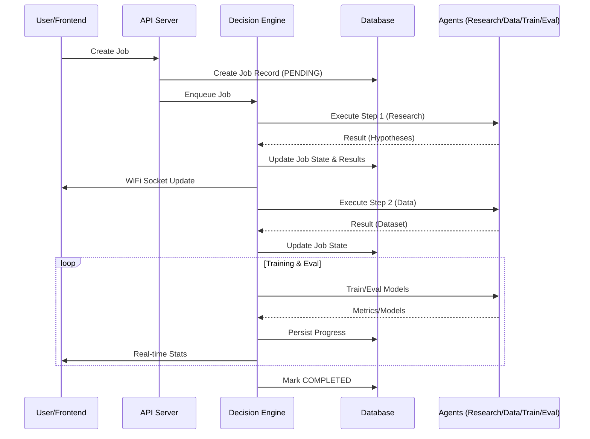

# System Architecture

## Overview

The Multi-Agent AI Research Assistant is a distributed system with four specialized agents orchestrated by a Decision Engine. Communication occurs via a message bus with feedback loops for iteration.

## System Diagram

```
┌─────────────────────────────────────────────────────────────────┐
│                      Decision Engine                            │
│  ┌─────────────┐  ┌─────────────┐  ┌───────────────────────┐    │
│  │   State     │  │  Feedback   │  │   Communication       │    │
│  │  Manager    │  │  Handler    │  │      Bus              │    │
│  └─────────────┘  └─────────────┘  └───────────────────────┘    │
└─────────────────────────────────────────────────────────────────┘
         │                                       │
         ▼                                       ▼
┌─────────────────────────────────────────────────────────────────┐
│                         Agent Layer                             │
│  ┌──────────┐  ┌──────────┐  ┌──────────┐  ┌────────────┐       │
│  │ Research │──│   Data   │──│ Training │──│ Evaluation │       │
│  │  Agent   │  │  Agent   │  │  Agent   │  │   Agent    │       │
│  └──────────┘  └──────────┘  └──────────┘  └────────────┘       │
└─────────────────────────────────────────────────────────────────┘
```

## Components

### Agents

The system implements four specialized agents, detailed in [AGENTS.md](../AGENTS.md):

1.  **Research Agent**: Conducts literature review using Semantic Scholar/arXiv and LLMs to formulate hypotheses.
2.  **Data Agent**: Handles data acquisition, cleaning, and feature engineering with automated quality checks.
3.  **Training Agent**:
    - Parallel multi-model training (RF, XGBoost, NN, etc.)
    - Hyperparameter optimization via **Optuna**
    - Experiment tracking with **MLflow**
    - Model explainability using **SHAP**
4.  **Evaluation Agent**:
    - Statistical significance testing (T-tests, Wilcoxon)
    - Ablation studies
    - Final model ranking and report generation

### Orchestration

#### Decision Engine
The core orchestrator (`orchestration/decision_engine.py`) that:
- Manages the lifecycle of a `Job`.
- Persists state changes to the PostgreSQL database (`Job` model).
- Broker messages between agents.
- Emits real-time updates via WebSockets.

#### State Management
Workflow state is persisted in the database to ensure resilience against restarts.
State transitions:
```
PENDING → RESEARCHING → DATA_COLLECTION → TRAINING → EVALUATION → COMPLETED
             ↓                ↓               ↓           ↓
           FAILED ←───────────────────────────────────────
```

#### Communication
- **Internal**: Async message passing within the Python application.
- **External**: REST API for job management, WebSockets for live status.

### Data Flow



## Configuration

Configuration is managed via `config/config.yaml` and environment variables (`.env`).
Key settings include:
- `LLM_PROVIDER`: OpenAI or Anthropic.
- `NUM_WORKERS`: For parallel job processing.
- `DATABASE_URL` & `REDIS_URL`: Infrastructure connections.

## Deployment

The system is designed to be deployed via Docker Compose.
See [deployment.md](deployment.md) for detailed instructions.

```bash
# Quick Start
docker-compose up --build -d
```

## Extension Points

1.  **New Agents**: Inherit from `BaseAgent` in `agents/base_agent.py`.
2.  **New Models**: Add sklearn-compatible estimators to `TrainingAgent`.
3.  **Data Sources**: Implement new connectors in `DataAgent`.
